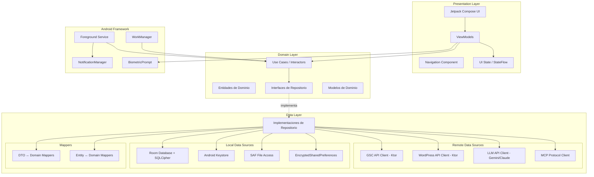
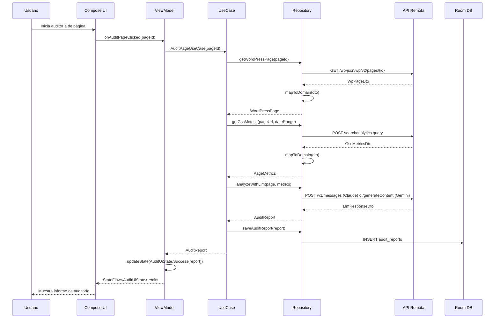
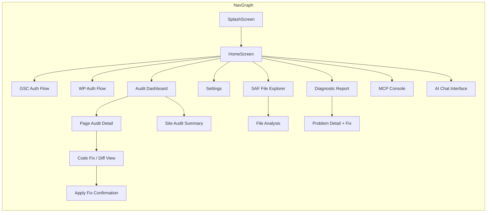

# Documento de Diseño Técnico: SEO Audit Tool — Android Nativo

## Resumen de Investigación

### Hallazgos Clave

**MCP (Model Context Protocol) en Kotlin:**
- El protocolo MCP permite comunicación bidireccional con LLMs mediante JSON-RPC 2.0
- La implementación cliente en Kotlin requiere manejo de Tools, Prompts y Resources
- La comunicación puede realizarse sobre WebSocket o HTTP con SSE (Server-Sent Events)
- Se necesita serialización JSON con kotlinx.serialization para los mensajes del protocolo

**Google Sign-In para Android:**
- La librería `com.google.android.gms:play-services-auth` proporciona OAuth 2.0 nativo
- El flujo presenta el selector de cuenta estándar de Google con consentimiento de scopes
- Los tokens se almacenan en AccountManager del sistema, refresh automático disponible
- Scope necesario: `https://www.googleapis.com/auth/webmasters.readonly`

**WordPress REST API con Ktor/Retrofit:**
- Ktor Client para Android soporta HTTP/2, serialización automática y coroutines nativas
- Application Passwords de WordPress permiten auth HTTP Basic sobre HTTPS
- Endpoints principales: `/wp-json/wp/v2/pages`, `/wp-json/wp/v2/themes`, `/wp-json/wp/v2/plugins`

**Android Keystore + Room + SQLCipher:**
- Android Keystore protege claves criptográficas a nivel de hardware (TEE/StrongBox)
- Room con SQLCipher proporciona base de datos cifrada transparente
- EncryptedSharedPreferences para datos clave-valor sensibles pequeños

**Gemini API y Anthropic Claude API:**
- Ambas APIs soportan streaming de respuestas via SSE
- Gemini: `generativelanguage.googleapis.com/v1beta/models/gemini-pro:generateContent`
- Claude: `api.anthropic.com/v1/messages` con header `x-api-key`

---

## Overview


La herramienta de auditoría SEO es una **aplicación nativa de Android** implementada en **Kotlin** con **Jetpack Compose** que actúa como Cliente MCP y Orquestador de IA. Integra Google Search Console y WordPress para proporcionar capacidades de auditoría SEO automatizada con asistencia de inteligencia artificial (Gemini API / Anthropic Claude API). La aplicación permite a los usuarios conectar sus cuentas, obtener métricas de rendimiento, auditar páginas en busca de problemas SEO, acceder a archivos locales mediante SAF, y aplicar correcciones de código generadas por IA directamente en WordPress o en archivos locales del proyecto.

### Decisiones de Diseño

| Decisión | Elección | Justificación |
|----------|----------|---------------|
| Lenguaje | Kotlin | Lenguaje oficial de Android, coroutines nativas, null-safety |
| UI Framework | Jetpack Compose + Material Design 3 | UI declarativa moderna, optimizada para móvil |
| Arquitectura | Clean Architecture (Data/Domain/Presentation) | Separación de responsabilidades, testabilidad |
| Organización | Feature-by-Feature modular | Escalabilidad, compilación incremental |
| Concurrencia | Kotlin Coroutines & Flow | Manejo reactivo de datos, cancelación estructurada |
| DI | Hilt (Dagger) | Soporte oficial de Android, integración con ViewModel |
| HTTP Client | Ktor Client | Coroutines nativas, multiplataforma, serialización integrada |
| Base de Datos | Room + SQLCipher | ORM oficial de Android + cifrado transparente |
| Almacenamiento seguro | Android Keystore | Protección hardware de claves criptográficas |
| Auth GSC | Google Sign-In nativo | UX familiar, refresh automático, AccountManager |
| Auth WordPress | Application Passwords + Ktor | Sin plugins adicionales, estándar REST API |
| Archivos locales | Storage Access Framework (SAF) | Permisos granulares, persistencia de URI |
| Background | WorkManager + Foreground Services | Resiliencia ante cierre de app, notificaciones |
| MCP Protocol | Implementación cliente en Kotlin (kotlinx.serialization) | Control total, integración con coroutines |
| IA/LLM | Gemini API + Anthropic Claude API | Flexibilidad de proveedor, streaming SSE |
| Testing | JUnit5 + Turbine + Compose Testing + Robolectric | Cobertura completa de capas |

---

## Architecture

### Diagrama de Arquitectura Clean Architecture




### Estructura de Paquetes (Feature-by-Feature)

```
com.seoaudit.app/
├── di/                          # Módulos Hilt globales
│   ├── AppModule.kt
│   ├── NetworkModule.kt
│   ├── DatabaseModule.kt
│   └── SecurityModule.kt
├── core/                        # Código compartido entre features
│   ├── data/
│   │   ├── db/                  # Room Database, DAOs base
│   │   ├── network/             # Ktor client config, interceptors
│   │   └── security/            # Keystore wrapper, cipher utils
│   ├── domain/
│   │   ├── model/               # Entidades de dominio compartidas
│   │   └── util/                # Extensions, DateUtils
│   └── presentation/
│       ├── components/          # Composables reutilizables
│       ├── navigation/          # NavGraph, rutas
│       └── theme/               # Material Design 3 theme
├── feature/
│   ├── auth/                    # Feature: Autenticación
│   │   ├── data/
│   │   ├── domain/
│   │   └── presentation/
│   ├── gsc/                     # Feature: Google Search Console
│   │   ├── data/
│   │   ├── domain/
│   │   └── presentation/
│   ├── wordpress/               # Feature: WordPress connector
│   │   ├── data/
│   │   ├── domain/
│   │   └── presentation/
│   ├── filesystem/              # Feature: SAF file access
│   │   ├── data/
│   │   ├── domain/
│   │   └── presentation/
│   ├── audit/                   # Feature: Motor de auditoría SEO
│   │   ├── data/
│   │   ├── domain/
│   │   └── presentation/
│   ├── ai/                      # Feature: Motor IA (Gemini/Claude)
│   │   ├── data/
│   │   ├── domain/
│   │   └── presentation/
│   ├── mcp/                     # Feature: MCP Client/Server
│   │   ├── data/
│   │   ├── domain/
│   │   └── presentation/
│   ├── diagnostic/              # Feature: Informes diagnósticos
│   │   ├── data/
│   │   ├── domain/
│   │   └── presentation/
│   └── codegen/                 # Feature: Generación de código/diff
│       ├── data/
│       ├── domain/
│       └── presentation/
└── background/                  # WorkManager workers, ForegroundService
    ├── SyncWorker.kt
    ├── AuditForegroundService.kt
    └── NotificationHelper.kt
```

### Flujo de Datos Principal




### Diagrama de Navegación



---

## Components and Interfaces

### 1. Capa de Dominio — Entidades e Interfaces

#### Interfaces de Repositorio (Domain Layer)

```kotlin
// core/domain/repository/GscRepository.kt
interface GscRepository {
    suspend fun authenticate(): Result<GscAuthResult>
    suspend fun listSites(): Result<List<GscSite>>
    suspend fun getPerformanceData(
        siteUrl: String,
        dateRange: DateRange,
        dimensions: List<GscDimension>
    ): Result<PerformanceData>
    suspend fun getPageMetrics(
        siteUrl: String,
        pageUrl: String,
        dateRange: DateRange
    ): Result<PageMetrics>
    fun observeConnectionStatus(): Flow<ConnectionStatus>
}

// core/domain/repository/WordPressRepository.kt
interface WordPressRepository {
    suspend fun authenticate(config: WpConnectionConfig): Result<WpAuthResult>
    suspend fun getPage(pageId: Long): Result<WordPressPage>
    suspend fun listPages(params: PageListParams): Result<PaginatedResult<WordPressPage>>
    suspend fun updatePage(pageId: Long, update: PageUpdate): Result<WordPressPage>
    suspend fun listThemes(): Result<List<WpTheme>>
    suspend fun listPlugins(): Result<List<WpPlugin>>
    fun observeConnectionStatus(): Flow<ConnectionStatus>
}

// core/domain/repository/FileSystemRepository.kt
interface FileSystemRepository {
    suspend fun requestDirectoryAccess(): Result<Uri>
    suspend fun readFile(uri: Uri): Result<FileContent>
    suspend fun writeFile(uri: Uri, content: ByteArray): Result<Unit>
    suspend fun createBackup(uri: Uri): Result<Uri>
    suspend fun listFiles(directoryUri: Uri, extensions: List<String>): Result<List<FileInfo>>
    fun hasPersistedPermission(uri: Uri): Boolean
}

// core/domain/repository/AiRepository.kt
interface AiRepository {
    suspend fun analyzeHtml(
        html: String,
        metrics: PageMetrics?,
        context: AuditContext
    ): Result<AuditReport>
    suspend fun generateCodeFix(
        issue: AuditIssue,
        originalCode: String
    ): Result<CodeFix>
    suspend fun crossAnalyze(
        metrics: PerformanceData,
        sourceCode: Map<String, String>
    ): Result<DiagnosticReport>
    fun streamResponse(prompt: String): Flow<String>
}

// core/domain/repository/CredentialRepository.kt
interface CredentialRepository {
    suspend fun storeCredential(key: String, value: String): Result<Unit>
    suspend fun retrieveCredential(key: String): Result<String?>
    suspend fun deleteCredential(key: String): Result<Unit>
    suspend fun clearAll(): Result<Unit>
    suspend fun exists(key: String): Boolean
}

// core/domain/repository/McpRepository.kt
interface McpRepository {
    suspend fun connect(serverUrl: String): Result<McpSession>
    suspend fun callTool(session: McpSession, tool: String, params: JsonObject): Result<McpToolResult>
    suspend fun listTools(session: McpSession): Result<List<McpTool>>
    suspend fun listResources(session: McpSession): Result<List<McpResource>>
    fun observeSessionState(): Flow<McpSessionState>
}
```


#### Casos de Uso (Domain Layer)

```kotlin
// feature/audit/domain/usecase/AuditPageUseCase.kt
class AuditPageUseCase @Inject constructor(
    private val wpRepository: WordPressRepository,
    private val gscRepository: GscRepository,
    private val aiRepository: AiRepository,
    private val dateUtils: DateUtils
) {
    suspend operator fun invoke(pageId: Long, includeMetrics: Boolean = true): Result<AuditReport> {
        val page = wpRepository.getPage(pageId).getOrElse { return Result.failure(it) }
        
        val metrics = if (includeMetrics) {
            val dateRange = dateUtils.defaultDateRange()
            gscRepository.getPageMetrics(page.siteUrl, page.url, dateRange).getOrNull()
        } else null
        
        return aiRepository.analyzeHtml(page.content, metrics, AuditContext(page.url))
    }
}

// feature/audit/domain/usecase/AuditSiteUseCase.kt
class AuditSiteUseCase @Inject constructor(
    private val wpRepository: WordPressRepository,
    private val auditPageUseCase: AuditPageUseCase
) {
    operator fun invoke(maxPages: Int = 50): Flow<SiteAuditProgress> = flow {
        val pages = wpRepository.listPages(PageListParams(perPage = maxPages))
            .getOrElse { 
                emit(SiteAuditProgress.Error(it))
                return@flow 
            }
        
        val reports = mutableListOf<AuditReport>()
        pages.items.forEachIndexed { index, page ->
            emit(SiteAuditProgress.InProgress(index + 1, pages.items.size))
            auditPageUseCase(page.id).onSuccess { reports.add(it) }
        }
        
        emit(SiteAuditProgress.Complete(SiteAuditReport.fromPages(reports)))
    }
}

// feature/codegen/domain/usecase/GenerateDiffUseCase.kt
class GenerateDiffUseCase @Inject constructor(
    private val diffEngine: DiffEngine
) {
    operator fun invoke(original: String, modified: String): DiffResult {
        return diffEngine.generateDiff(original, modified)
    }
}

// feature/codegen/domain/usecase/ApplyFixUseCase.kt
class ApplyFixUseCase @Inject constructor(
    private val wpRepository: WordPressRepository,
    private val fsRepository: FileSystemRepository
) {
    suspend fun applyToWordPress(pageId: Long, fixedContent: String): Result<WordPressPage> {
        return wpRepository.updatePage(pageId, PageUpdate(content = fixedContent))
    }
    
    suspend fun applyToLocalFile(fileUri: Uri, fixedContent: ByteArray): Result<Unit> {
        fsRepository.createBackup(fileUri).getOrElse { return Result.failure(it) }
        return fsRepository.writeFile(fileUri, fixedContent)
    }
}

// core/domain/usecase/AuthLockoutUseCase.kt
class AuthLockoutUseCase @Inject constructor(
    private val lockoutTracker: AuthLockoutTracker,
    private val clock: Clock
) {
    fun recordFailedAttempt(service: ServiceType): LockoutState {
        return lockoutTracker.recordFailure(service, clock.now())
    }
    
    fun isLocked(service: ServiceType): Boolean {
        return lockoutTracker.isLocked(service, clock.now())
    }
    
    fun getRemainingLockoutTime(service: ServiceType): Duration? {
        return lockoutTracker.remainingTime(service, clock.now())
    }
}
```

### 2. Capa de Datos — Implementaciones

#### Cliente HTTP (Ktor)

```kotlin
// core/data/network/KtorClientFactory.kt
@Module
@InstallIn(SingletonComponent::class)
object NetworkModule {
    
    @Provides
    @Singleton
    fun provideHttpClient(): HttpClient = HttpClient(Android) {
        install(ContentNegotiation) {
            json(Json {
                ignoreUnknownKeys = true
                isLenient = true
            })
        }
        install(Logging) {
            level = LogLevel.HEADERS
        }
        install(HttpTimeout) {
            requestTimeoutMillis = 30_000
            connectTimeoutMillis = 10_000
        }
        install(HttpRequestRetry) {
            maxRetries = 3
            retryOnServerErrors()
            exponentialDelay()
        }
        defaultRequest {
            contentType(ContentType.Application.Json)
        }
    }
}
```


#### Implementación del Conector GSC

```kotlin
// feature/gsc/data/remote/GscApiService.kt
class GscApiService @Inject constructor(
    private val httpClient: HttpClient,
    private val tokenManager: GscTokenManager
) {
    suspend fun queryAnalytics(request: GscAnalyticsRequest): GscAnalyticsResponse {
        val token = tokenManager.getValidToken()
        return httpClient.post("https://searchconsole.googleapis.com/webmasters/v3/sites/${request.siteUrl.encodeURLPath()}/searchAnalytics/query") {
            bearerAuth(token)
            setBody(request)
        }.body()
    }
    
    suspend fun listSites(): List<GscSiteDto> {
        val token = tokenManager.getValidToken()
        return httpClient.get("https://searchconsole.googleapis.com/webmasters/v3/sites") {
            bearerAuth(token)
        }.body<GscSitesListResponse>().siteEntry
    }
}

// feature/gsc/data/GscTokenManager.kt
class GscTokenManager @Inject constructor(
    private val credentialRepository: CredentialRepository,
    private val googleSignInClient: GoogleSignInClient,
    private val clock: Clock
) {
    private var cachedToken: String? = null
    private var expiresAt: Instant = Instant.EPOCH
    
    suspend fun getValidToken(): String {
        if (cachedToken != null && clock.now() < expiresAt) {
            return cachedToken!!
        }
        return refreshToken()
    }
    
    private suspend fun refreshToken(): String {
        val account = googleSignInClient.silentSignIn().await()
        cachedToken = account.idToken ?: throw AuthenticationException("Token refresh failed")
        expiresAt = clock.now().plus(55.minutes) // tokens expire in 60min, refresh early
        return cachedToken!!
    }
    
    fun isTokenExpired(): Boolean = clock.now() >= expiresAt
}
```

#### Implementación del Conector WordPress

```kotlin
// feature/wordpress/data/remote/WpApiService.kt
class WpApiService @Inject constructor(
    private val httpClient: HttpClient
) {
    private var baseUrl: String = ""
    private var authHeader: String = ""
    
    fun configure(siteUrl: String, username: String, appPassword: String) {
        baseUrl = siteUrl.trimEnd('/')
        authHeader = Base64.encodeToString(
            "$username:$appPassword".toByteArray(),
            Base64.NO_WRAP
        )
    }
    
    suspend fun getPage(pageId: Long): WpPageDto {
        return httpClient.get("$baseUrl/wp-json/wp/v2/pages/$pageId") {
            header("Authorization", "Basic $authHeader")
        }.body()
    }
    
    suspend fun listPages(params: WpPageListParams): List<WpPageDto> {
        return httpClient.get("$baseUrl/wp-json/wp/v2/pages") {
            header("Authorization", "Basic $authHeader")
            parameter("per_page", params.perPage)
            parameter("page", params.page)
            params.status?.let { parameter("status", it) }
        }.body()
    }
    
    suspend fun updatePage(pageId: Long, update: WpPageUpdateDto): WpPageDto {
        return httpClient.post("$baseUrl/wp-json/wp/v2/pages/$pageId") {
            header("Authorization", "Basic $authHeader")
            setBody(update)
        }.body()
    }
    
    suspend fun listThemes(): List<WpThemeDto> {
        return httpClient.get("$baseUrl/wp-json/wp/v2/themes") {
            header("Authorization", "Basic $authHeader")
        }.body()
    }
    
    suspend fun listPlugins(): List<WpPluginDto> {
        return httpClient.get("$baseUrl/wp-json/wp/v2/plugins") {
            header("Authorization", "Basic $authHeader")
        }.body()
    }
}
```


#### Implementación del Motor de Diferencias

```kotlin
// feature/codegen/domain/engine/DiffEngine.kt
interface DiffEngine {
    fun generateDiff(original: String, modified: String): DiffResult
    fun applyDiff(original: String, diff: DiffResult): String
    fun validateDiff(original: String, diff: DiffResult, expected: String): Boolean
}

// feature/codegen/data/DiffEngineImpl.kt
class DiffEngineImpl @Inject constructor() : DiffEngine {
    
    override fun generateDiff(original: String, modified: String): DiffResult {
        val originalLines = original.lines()
        val modifiedLines = modified.lines()
        val hunks = computeLcsDiff(originalLines, modifiedLines)
        
        return DiffResult(
            hunks = hunks,
            additions = hunks.sumOf { it.lines.count { l -> l.type == DiffLineType.ADD } },
            deletions = hunks.sumOf { it.lines.count { l -> l.type == DiffLineType.REMOVE } }
        )
    }
    
    override fun applyDiff(original: String, diff: DiffResult): String {
        // Apply hunks to original text to produce modified text
        val lines = original.lines().toMutableList()
        var offset = 0
        diff.hunks.forEach { hunk ->
            val startIndex = hunk.oldStart - 1 + offset
            val toRemove = hunk.lines.filter { it.type == DiffLineType.REMOVE }
            val toAdd = hunk.lines.filter { it.type == DiffLineType.ADD }
            
            repeat(toRemove.size) { lines.removeAt(startIndex) }
            toAdd.forEachIndexed { i, line -> lines.add(startIndex + i, line.content) }
            offset += toAdd.size - toRemove.size
        }
        return lines.joinToString("\n")
    }
    
    override fun validateDiff(original: String, diff: DiffResult, expected: String): Boolean {
        return applyDiff(original, diff) == expected
    }
}
```

#### Implementación de Seguridad (Android Keystore)

```kotlin
// core/data/security/KeystoreCredentialStore.kt
class KeystoreCredentialStore @Inject constructor(
    @ApplicationContext private val context: Context
) : CredentialRepository {
    
    private val keyStore = KeyStore.getInstance("AndroidKeyStore").apply { load(null) }
    private val masterKey = MasterKey.Builder(context)
        .setKeyScheme(MasterKey.KeyScheme.AES256_GCM)
        .build()
    private val encryptedPrefs = EncryptedSharedPreferences.create(
        context,
        "secure_credentials",
        masterKey,
        EncryptedSharedPreferences.PrefKeyEncryptionScheme.AES256_SIV,
        EncryptedSharedPreferences.PrefValueEncryptionScheme.AES256_GCM
    )
    
    override suspend fun storeCredential(key: String, value: String): Result<Unit> =
        withContext(Dispatchers.IO) {
            runCatching {
                encryptedPrefs.edit().putString(key, value).apply()
            }
        }
    
    override suspend fun retrieveCredential(key: String): Result<String?> =
        withContext(Dispatchers.IO) {
            runCatching {
                encryptedPrefs.getString(key, null)
            }
        }
    
    override suspend fun deleteCredential(key: String): Result<Unit> =
        withContext(Dispatchers.IO) {
            runCatching {
                encryptedPrefs.edit().remove(key).apply()
            }
        }
    
    override suspend fun clearAll(): Result<Unit> =
        withContext(Dispatchers.IO) {
            runCatching {
                encryptedPrefs.edit().clear().apply()
            }
        }
    
    override suspend fun exists(key: String): Boolean =
        encryptedPrefs.contains(key)
}
```


#### Implementación del Cliente MCP en Kotlin

```kotlin
// feature/mcp/data/McpClientImpl.kt
class McpClientImpl @Inject constructor(
    private val httpClient: HttpClient,
    private val json: Json
) : McpRepository {
    
    private var session: McpSession? = null
    private val _sessionState = MutableStateFlow<McpSessionState>(McpSessionState.Disconnected)
    
    override suspend fun connect(serverUrl: String): Result<McpSession> = runCatching {
        _sessionState.value = McpSessionState.Connecting
        
        val initRequest = McpMessage.Initialize(
            protocolVersion = "2024-11-05",
            capabilities = McpClientCapabilities(
                tools = ToolCapabilities(listChanged = true),
                resources = ResourceCapabilities(subscribe = true)
            ),
            clientInfo = McpClientInfo(name = "SEOAuditAndroid", version = "1.0.0")
        )
        
        val response = httpClient.post("$serverUrl/mcp") {
            setBody(json.encodeToString(initRequest))
        }.body<McpMessage.InitializeResult>()
        
        val newSession = McpSession(
            serverUrl = serverUrl,
            serverCapabilities = response.capabilities,
            sessionId = response.sessionId
        )
        session = newSession
        _sessionState.value = McpSessionState.Connected(newSession)
        newSession
    }
    
    override suspend fun callTool(
        session: McpSession,
        tool: String,
        params: JsonObject
    ): Result<McpToolResult> = runCatching {
        val request = McpMessage.ToolCall(
            method = "tools/call",
            params = McpToolCallParams(name = tool, arguments = params)
        )
        httpClient.post("${session.serverUrl}/mcp") {
            header("X-Session-Id", session.sessionId)
            setBody(json.encodeToString(request))
        }.body()
    }
    
    override suspend fun listTools(session: McpSession): Result<List<McpTool>> = runCatching {
        httpClient.post("${session.serverUrl}/mcp") {
            header("X-Session-Id", session.sessionId)
            setBody("""{"method": "tools/list", "params": {}}""")
        }.body<McpToolListResult>().tools
    }
    
    override suspend fun listResources(session: McpSession): Result<List<McpResource>> = runCatching {
        httpClient.post("${session.serverUrl}/mcp") {
            header("X-Session-Id", session.sessionId)
            setBody("""{"method": "resources/list", "params": {}}""")
        }.body<McpResourceListResult>().resources
    }
    
    override fun observeSessionState(): Flow<McpSessionState> = _sessionState.asStateFlow()
}
```

#### Implementación del Conector de Sistema de Archivos (SAF)

```kotlin
// feature/filesystem/data/SafFileRepository.kt
class SafFileRepository @Inject constructor(
    @ApplicationContext private val context: Context,
    private val contentResolver: ContentResolver
) : FileSystemRepository {
    
    override suspend fun requestDirectoryAccess(): Result<Uri> {
        // This will be triggered from the UI via ActivityResultLauncher
        return Result.failure(UnsupportedOperationException("Use Activity result"))
    }
    
    override suspend fun readFile(uri: Uri): Result<FileContent> =
        withContext(Dispatchers.IO) {
            runCatching {
                contentResolver.openInputStream(uri)?.use { stream ->
                    val bytes = stream.readBytes()
                    val charset = detectCharset(bytes)
                    FileContent(
                        uri = uri,
                        content = bytes,
                        charset = charset,
                        mimeType = contentResolver.getType(uri) ?: "text/plain"
                    )
                } ?: throw FileNotFoundException("Cannot open: $uri")
            }
        }
    
    override suspend fun writeFile(uri: Uri, content: ByteArray): Result<Unit> =
        withContext(Dispatchers.IO) {
            runCatching {
                contentResolver.openOutputStream(uri, "wt")?.use { stream ->
                    stream.write(content)
                } ?: throw FileNotFoundException("Cannot write: $uri")
            }
        }
    
    override suspend fun createBackup(uri: Uri): Result<Uri> =
        withContext(Dispatchers.IO) {
            runCatching {
                val original = readFile(uri).getOrThrow()
                val backupName = "${uri.lastPathSegment}.bak"
                val parentUri = DocumentsContract.buildDocumentUriUsingTree(
                    uri, DocumentsContract.getTreeDocumentId(uri)
                )
                val backupUri = DocumentsContract.createDocument(
                    contentResolver, parentUri, original.mimeType, backupName
                ) ?: throw IOException("Cannot create backup")
                writeFile(backupUri, original.content).getOrThrow()
                backupUri
            }
        }
    
    override suspend fun listFiles(directoryUri: Uri, extensions: List<String>): Result<List<FileInfo>> =
        withContext(Dispatchers.IO) {
            runCatching {
                val childrenUri = DocumentsContract.buildChildDocumentsUriUsingTree(
                    directoryUri, DocumentsContract.getDocumentId(directoryUri)
                )
                val files = mutableListOf<FileInfo>()
                contentResolver.query(childrenUri, null, null, null, null)?.use { cursor ->
                    while (cursor.moveToNext()) {
                        val name = cursor.getString(cursor.getColumnIndex(DocumentsContract.Document.COLUMN_DISPLAY_NAME))
                        if (extensions.isEmpty() || extensions.any { name.endsWith(it) }) {
                            files.add(FileInfo(
                                name = name,
                                uri = DocumentsContract.buildDocumentUriUsingTree(directoryUri, cursor.getString(0)),
                                size = cursor.getLong(cursor.getColumnIndex(DocumentsContract.Document.COLUMN_SIZE)),
                                mimeType = cursor.getString(cursor.getColumnIndex(DocumentsContract.Document.COLUMN_MIME_TYPE))
                            ))
                        }
                    }
                }
                files
            }
        }
    
    override fun hasPersistedPermission(uri: Uri): Boolean {
        return context.contentResolver.persistedUriPermissions.any { it.uri == uri && it.isReadPermission }
    }
}
```


### 3. Capa de Presentación — ViewModels y UI State

```kotlin
// feature/audit/presentation/AuditViewModel.kt
@HiltViewModel
class AuditViewModel @Inject constructor(
    private val auditPageUseCase: AuditPageUseCase,
    private val auditSiteUseCase: AuditSiteUseCase,
    private val savedStateHandle: SavedStateHandle
) : ViewModel() {
    
    private val _uiState = MutableStateFlow<AuditUiState>(AuditUiState.Idle)
    val uiState: StateFlow<AuditUiState> = _uiState.asStateFlow()
    
    fun auditPage(pageId: Long) {
        viewModelScope.launch {
            _uiState.value = AuditUiState.Loading
            auditPageUseCase(pageId)
                .onSuccess { report -> _uiState.value = AuditUiState.Success(report) }
                .onFailure { error -> _uiState.value = AuditUiState.Error(error.toUiError()) }
        }
    }
    
    fun auditSite(maxPages: Int = 50) {
        viewModelScope.launch {
            auditSiteUseCase(maxPages).collect { progress ->
                _uiState.value = when (progress) {
                    is SiteAuditProgress.InProgress -> AuditUiState.SiteAuditProgress(
                        current = progress.current, total = progress.total
                    )
                    is SiteAuditProgress.Complete -> AuditUiState.SiteAuditComplete(progress.report)
                    is SiteAuditProgress.Error -> AuditUiState.Error(progress.error.toUiError())
                }
            }
        }
    }
}

// feature/audit/presentation/AuditUiState.kt
sealed interface AuditUiState {
    data object Idle : AuditUiState
    data object Loading : AuditUiState
    data class Success(val report: AuditReport) : AuditUiState
    data class SiteAuditProgress(val current: Int, val total: Int) : AuditUiState
    data class SiteAuditComplete(val report: SiteAuditReport) : AuditUiState
    data class Error(val error: UiError) : AuditUiState
}

// feature/auth/presentation/AuthViewModel.kt
@HiltViewModel
class AuthViewModel @Inject constructor(
    private val gscRepository: GscRepository,
    private val wpRepository: WordPressRepository,
    private val authLockoutUseCase: AuthLockoutUseCase,
    private val credentialRepository: CredentialRepository
) : ViewModel() {
    
    private val _gscState = MutableStateFlow<AuthState>(AuthState.Disconnected)
    val gscState: StateFlow<AuthState> = _gscState.asStateFlow()
    
    private val _wpState = MutableStateFlow<AuthState>(AuthState.Disconnected)
    val wpState: StateFlow<AuthState> = _wpState.asStateFlow()
    
    fun authenticateGsc() {
        viewModelScope.launch {
            if (authLockoutUseCase.isLocked(ServiceType.GSC)) {
                val remaining = authLockoutUseCase.getRemainingLockoutTime(ServiceType.GSC)
                _gscState.value = AuthState.LockedOut(remaining)
                return@launch
            }
            _gscState.value = AuthState.Authenticating
            gscRepository.authenticate()
                .onSuccess { _gscState.value = AuthState.Connected(it) }
                .onFailure { 
                    authLockoutUseCase.recordFailedAttempt(ServiceType.GSC)
                    _gscState.value = AuthState.Error(it.toUiError())
                }
        }
    }
    
    fun authenticateWordPress(siteUrl: String, username: String, appPassword: String) {
        viewModelScope.launch {
            if (authLockoutUseCase.isLocked(ServiceType.WORDPRESS)) {
                val remaining = authLockoutUseCase.getRemainingLockoutTime(ServiceType.WORDPRESS)
                _wpState.value = AuthState.LockedOut(remaining)
                return@launch
            }
            _wpState.value = AuthState.Authenticating
            val config = WpConnectionConfig(siteUrl, username, appPassword)
            wpRepository.authenticate(config)
                .onSuccess { _wpState.value = AuthState.Connected(it) }
                .onFailure {
                    authLockoutUseCase.recordFailedAttempt(ServiceType.WORDPRESS)
                    _wpState.value = AuthState.Error(it.toUiError())
                }
        }
    }
    
    fun disconnect(service: ServiceType) {
        viewModelScope.launch {
            credentialRepository.deleteCredential(service.credentialKey)
            when (service) {
                ServiceType.GSC -> _gscState.value = AuthState.Disconnected
                ServiceType.WORDPRESS -> _wpState.value = AuthState.Disconnected
            }
        }
    }
}
```

### 4. Servidor MCP Expuesto (Herramientas)

```kotlin
// feature/mcp/data/McpServerImpl.kt
class McpServerImpl @Inject constructor(
    private val auditPageUseCase: AuditPageUseCase,
    private val gscRepository: GscRepository,
    private val wpRepository: WordPressRepository,
    private val generateDiffUseCase: GenerateDiffUseCase,
    private val applyFixUseCase: ApplyFixUseCase,
    private val json: Json
) {
    val tools: List<McpToolDefinition> = listOf(
        McpToolDefinition(
            name = "gsc_authenticate",
            description = "Autenticar con Google Search Console",
            inputSchema = GscAuthParams.schema()
        ),
        McpToolDefinition(
            name = "gsc_list_sites",
            description = "Listar sitios disponibles en GSC",
            inputSchema = EmptyParams.schema()
        ),
        McpToolDefinition(
            name = "gsc_get_performance",
            description = "Obtener métricas de rendimiento SEO",
            inputSchema = GscPerformanceParams.schema()
        ),
        McpToolDefinition(
            name = "wp_authenticate",
            description = "Autenticar con WordPress",
            inputSchema = WpAuthParams.schema()
        ),
        McpToolDefinition(
            name = "wp_list_pages",
            description = "Listar páginas del sitio WordPress",
            inputSchema = WpListPagesParams.schema()
        ),
        McpToolDefinition(
            name = "audit_page",
            description = "Auditar una página individual para problemas SEO",
            inputSchema = AuditPageParams.schema()
        ),
        McpToolDefinition(
            name = "audit_site",
            description = "Auditar todo el sitio WordPress",
            inputSchema = AuditSiteParams.schema()
        ),
        McpToolDefinition(
            name = "generate_fix",
            description = "Generar solución de código para problema SEO",
            inputSchema = GenerateFixParams.schema()
        ),
        McpToolDefinition(
            name = "apply_fix",
            description = "Aplicar corrección a la página",
            inputSchema = ApplyFixParams.schema()
        ),
        McpToolDefinition(
            name = "disconnect_account",
            description = "Desconectar una cuenta (GSC o WordPress)",
            inputSchema = DisconnectParams.schema()
        )
    )
    
    suspend fun handleToolCall(toolName: String, params: JsonObject): McpToolResult {
        return when (toolName) {
            "audit_page" -> {
                val pageId = params["pageId"]?.jsonPrimitive?.long
                    ?: return McpToolResult.error("pageId es requerido")
                auditPageUseCase(pageId).fold(
                    onSuccess = { McpToolResult.success(json.encodeToString(it)) },
                    onFailure = { McpToolResult.error(it.message ?: "Error desconocido") }
                )
            }
            // ... demás herramientas
            else -> McpToolResult.error("Herramienta no encontrada: $toolName")
        }
    }
}
```


---

## Data Models

### Entidades de Dominio

```kotlin
// core/domain/model/AuditModels.kt
data class AuditReport(
    val pageUrl: String,
    val pageTitle: String,
    val score: Int, // 0-100
    val issues: List<AuditIssue>,
    val metrics: PageMetrics?,
    val auditedAt: Instant
)

data class AuditIssue(
    val id: String,
    val category: AuditCategory,
    val severity: Severity,
    val title: String,
    val description: String,
    val impact: String,
    val recommendation: String,
    val element: String? = null,
    val fixable: Boolean
)

enum class AuditCategory {
    TITLE_TAG, META_DESCRIPTION, HEADINGS, ALT_ATTRIBUTES,
    INTERNAL_LINKS, STRUCTURED_DATA, LOAD_PERFORMANCE
}

enum class Severity { CRITICAL, WARNING, INFO }

data class SiteAuditReport(
    val siteUrl: String,
    val totalPages: Int,
    val auditedPages: Int,
    val overallScore: Int,
    val summary: AuditSummary,
    val pages: List<AuditReport>,
    val generatedAt: Instant
) {
    companion object {
        fun fromPages(reports: List<AuditReport>): SiteAuditReport {
            return SiteAuditReport(
                siteUrl = reports.firstOrNull()?.pageUrl?.substringBefore("/", "") ?: "",
                totalPages = reports.size,
                auditedPages = reports.size,
                overallScore = reports.map { it.score }.average().toInt(),
                summary = AuditSummary(
                    critical = reports.sumOf { r -> r.issues.count { it.severity == Severity.CRITICAL } },
                    warnings = reports.sumOf { r -> r.issues.count { it.severity == Severity.WARNING } },
                    info = reports.sumOf { r -> r.issues.count { it.severity == Severity.INFO } },
                    fixable = reports.sumOf { r -> r.issues.count { it.fixable } }
                ),
                pages = reports,
                generatedAt = Clock.System.now()
            )
        }
    }
}

data class AuditSummary(
    val critical: Int,
    val warnings: Int,
    val info: Int,
    val fixable: Int
)
```

```kotlin
// core/domain/model/GscModels.kt
data class GscSite(
    val siteUrl: String,
    val permissionLevel: String
)

data class PageMetrics(
    val pageUrl: String,
    val clicks: Int,
    val impressions: Int,
    val ctr: Double,
    val averagePosition: Double,
    val topQueries: List<QueryMetric>,
    val dateRange: DateRange
)

data class QueryMetric(
    val query: String,
    val clicks: Int,
    val impressions: Int,
    val ctr: Double,
    val position: Double
)

data class DateRange(
    val startDate: LocalDate,
    val endDate: LocalDate
)

data class PerformanceData(
    val siteUrl: String,
    val rows: List<PerformanceRow>,
    val dateRange: DateRange
)

data class PerformanceRow(
    val keys: List<String>,
    val clicks: Int,
    val impressions: Int,
    val ctr: Double,
    val position: Double
)

enum class GscDimension { QUERY, PAGE, COUNTRY, DEVICE, DATE }
```

```kotlin
// core/domain/model/WordPressModels.kt
data class WordPressPage(
    val id: Long,
    val title: String,
    val content: String, // HTML
    val excerpt: String,
    val slug: String,
    val status: PageStatus,
    val url: String,
    val siteUrl: String,
    val metaDescription: String?
)

enum class PageStatus { PUBLISH, DRAFT, PENDING, PRIVATE }

data class PageUpdate(
    val title: String? = null,
    val content: String? = null,
    val excerpt: String? = null,
    val meta: Map<String, String>? = null
)

data class PageListParams(
    val perPage: Int = 20,
    val page: Int = 1,
    val status: PageStatus? = null
)

data class PaginatedResult<T>(
    val items: List<T>,
    val totalItems: Int,
    val totalPages: Int,
    val currentPage: Int
)

data class WpTheme(
    val name: String,
    val version: String,
    val isActive: Boolean,
    val author: String
)

data class WpPlugin(
    val name: String,
    val version: String,
    val isActive: Boolean,
    val description: String
)
```


```kotlin
// core/domain/model/CodegenModels.kt
data class CodeFix(
    val issueId: String,
    val originalCode: String,
    val proposedCode: String,
    val diff: DiffResult,
    val explanation: String,
    val isValid: Boolean,
    val validationErrors: List<String> = emptyList()
)

data class DiffResult(
    val hunks: List<DiffHunk>,
    val additions: Int,
    val deletions: Int
)

data class DiffHunk(
    val oldStart: Int,
    val oldLines: Int,
    val newStart: Int,
    val newLines: Int,
    val lines: List<DiffLine>
)

data class DiffLine(
    val type: DiffLineType,
    val content: String,
    val lineNumber: Int
)

enum class DiffLineType { ADD, REMOVE, CONTEXT }
```

```kotlin
// core/domain/model/DiagnosticModels.kt
data class DiagnosticReport(
    val problems: List<DiagnosticProblem>,
    val generatedAt: Instant
)

data class DiagnosticProblem(
    val description: String,
    val origin: ProblemOrigin,
    val impact: ImpactLevel,
    val proposedSolution: String,
    val category: TechnicalCategory
)

enum class ProblemOrigin { GSC, CODE }
enum class ImpactLevel { HIGH, MEDIUM, LOW }
enum class TechnicalCategory { PERFORMANCE, HTML_STRUCTURE, STRUCTURED_DATA, BLOCKING_RESOURCES }
```

```kotlin
// core/domain/model/McpModels.kt
data class McpSession(
    val serverUrl: String,
    val serverCapabilities: McpServerCapabilities,
    val sessionId: String
)

sealed interface McpSessionState {
    data object Disconnected : McpSessionState
    data object Connecting : McpSessionState
    data class Connected(val session: McpSession) : McpSessionState
    data class Error(val message: String) : McpSessionState
}

data class McpTool(
    val name: String,
    val description: String,
    val inputSchema: JsonObject
)

data class McpResource(
    val uri: String,
    val name: String,
    val description: String,
    val mimeType: String
)

sealed interface McpToolResult {
    data class Success(val content: String) : McpToolResult
    data class Error(val code: Int, val message: String) : McpToolResult
    
    companion object {
        fun success(content: String) = Success(content)
        fun error(message: String, code: Int = -1) = Error(code, message)
    }
}
```

```kotlin
// core/domain/model/SecurityModels.kt
data class AuthLockoutState(
    val service: ServiceType,
    val failedAttempts: Int,
    val lastAttemptAt: Instant?,
    val lockedUntil: Instant?
) {
    val isLocked: Boolean get() = lockedUntil != null && Clock.System.now() < lockedUntil
}

enum class ServiceType(val credentialKey: String) {
    GSC("gsc_credentials"),
    WORDPRESS("wp_credentials"),
    GEMINI("gemini_api_key"),
    CLAUDE("claude_api_key")
}

sealed interface ConnectionStatus {
    data object Connected : ConnectionStatus
    data object Disconnected : ConnectionStatus
    data class Error(val message: String) : ConnectionStatus
}

data class FileContent(
    val uri: Uri,
    val content: ByteArray,
    val charset: Charset,
    val mimeType: String
)

data class FileInfo(
    val name: String,
    val uri: Uri,
    val size: Long,
    val mimeType: String
)
```

### Room Entities y DAOs

```kotlin
// core/data/db/entities/AuditReportEntity.kt
@Entity(tableName = "audit_reports")
data class AuditReportEntity(
    @PrimaryKey(autoGenerate = true) val id: Long = 0,
    @ColumnInfo(name = "page_url") val pageUrl: String,
    @ColumnInfo(name = "page_title") val pageTitle: String,
    @ColumnInfo(name = "score") val score: Int,
    @ColumnInfo(name = "issues_json") val issuesJson: String, // JSON serializado
    @ColumnInfo(name = "metrics_json") val metricsJson: String?, // JSON serializado
    @ColumnInfo(name = "audited_at") val auditedAt: Long // epoch millis
)

@Entity(tableName = "wp_pages_cache")
data class WpPageCacheEntity(
    @PrimaryKey val pageId: Long,
    @ColumnInfo(name = "site_url") val siteUrl: String,
    @ColumnInfo(name = "title") val title: String,
    @ColumnInfo(name = "content") val content: String,
    @ColumnInfo(name = "slug") val slug: String,
    @ColumnInfo(name = "status") val status: String,
    @ColumnInfo(name = "url") val url: String,
    @ColumnInfo(name = "cached_at") val cachedAt: Long,
    @ColumnInfo(name = "ttl_seconds") val ttlSeconds: Int = 3600
)

@Entity(tableName = "diagnostic_reports")
data class DiagnosticReportEntity(
    @PrimaryKey(autoGenerate = true) val id: Long = 0,
    @ColumnInfo(name = "site_url") val siteUrl: String,
    @ColumnInfo(name = "problems_json") val problemsJson: String,
    @ColumnInfo(name = "generated_at") val generatedAt: Long
)

@Entity(tableName = "auth_lockout")
data class AuthLockoutEntity(
    @PrimaryKey val service: String,
    @ColumnInfo(name = "failed_attempts") val failedAttempts: Int,
    @ColumnInfo(name = "last_attempt_at") val lastAttemptAt: Long?,
    @ColumnInfo(name = "locked_until") val lockedUntil: Long?
)
```


```kotlin
// core/data/db/dao/AuditReportDao.kt
@Dao
interface AuditReportDao {
    @Query("SELECT * FROM audit_reports WHERE page_url = :pageUrl ORDER BY audited_at DESC LIMIT 1")
    suspend fun getLatestForPage(pageUrl: String): AuditReportEntity?
    
    @Query("SELECT * FROM audit_reports ORDER BY audited_at DESC")
    fun observeAll(): Flow<List<AuditReportEntity>>
    
    @Insert(onConflict = OnConflictStrategy.REPLACE)
    suspend fun insert(report: AuditReportEntity): Long
    
    @Query("DELETE FROM audit_reports WHERE audited_at < :beforeTimestamp")
    suspend fun deleteOlderThan(beforeTimestamp: Long)
}

@Dao
interface WpPageCacheDao {
    @Query("SELECT * FROM wp_pages_cache WHERE pageId = :pageId AND (cached_at + ttl_seconds * 1000) > :now")
    suspend fun getCachedPage(pageId: Long, now: Long = System.currentTimeMillis()): WpPageCacheEntity?
    
    @Query("SELECT * FROM wp_pages_cache WHERE site_url = :siteUrl ORDER BY title ASC")
    fun observePages(siteUrl: String): Flow<List<WpPageCacheEntity>>
    
    @Insert(onConflict = OnConflictStrategy.REPLACE)
    suspend fun insertOrUpdate(page: WpPageCacheEntity)
    
    @Query("DELETE FROM wp_pages_cache WHERE site_url = :siteUrl")
    suspend fun clearCache(siteUrl: String)
}

@Dao
interface AuthLockoutDao {
    @Query("SELECT * FROM auth_lockout WHERE service = :service")
    suspend fun getLockout(service: String): AuthLockoutEntity?
    
    @Insert(onConflict = OnConflictStrategy.REPLACE)
    suspend fun insertOrUpdate(lockout: AuthLockoutEntity)
    
    @Query("DELETE FROM auth_lockout WHERE service = :service")
    suspend fun clearLockout(service: String)
}

// core/data/db/SeoAuditDatabase.kt
@Database(
    entities = [
        AuditReportEntity::class,
        WpPageCacheEntity::class,
        DiagnosticReportEntity::class,
        AuthLockoutEntity::class
    ],
    version = 1,
    exportSchema = true
)
@TypeConverters(Converters::class)
abstract class SeoAuditDatabase : RoomDatabase() {
    abstract fun auditReportDao(): AuditReportDao
    abstract fun wpPageCacheDao(): WpPageCacheDao
    abstract fun authLockoutDao(): AuthLockoutDao
}
```

### Configuración de Navegación (Jetpack Compose)

```kotlin
// core/presentation/navigation/AppNavGraph.kt
@Composable
fun AppNavGraph(
    navController: NavHostController = rememberNavController(),
    startDestination: String = Screen.Home.route
) {
    NavHost(navController = navController, startDestination = startDestination) {
        composable(Screen.Home.route) {
            HomeScreen(
                onNavigateToGscAuth = { navController.navigate(Screen.GscAuth.route) },
                onNavigateToWpAuth = { navController.navigate(Screen.WpAuth.route) },
                onNavigateToAudit = { navController.navigate(Screen.AuditDashboard.route) },
                onNavigateToFiles = { navController.navigate(Screen.FileExplorer.route) },
                onNavigateToSettings = { navController.navigate(Screen.Settings.route) },
                onNavigateToMcp = { navController.navigate(Screen.McpConsole.route) },
                onNavigateToAiChat = { navController.navigate(Screen.AiChat.route) }
            )
        }
        composable(Screen.GscAuth.route) { GscAuthScreen(navController) }
        composable(Screen.WpAuth.route) { WpAuthScreen(navController) }
        composable(Screen.AuditDashboard.route) { AuditDashboardScreen(navController) }
        composable(
            route = Screen.PageAudit.route,
            arguments = listOf(navArgument("pageId") { type = NavType.LongType })
        ) { backStackEntry ->
            val pageId = backStackEntry.arguments?.getLong("pageId") ?: return@composable
            PageAuditScreen(pageId = pageId, navController = navController)
        }
        composable(Screen.FileExplorer.route) { FileExplorerScreen(navController) }
        composable(Screen.DiagnosticReport.route) { DiagnosticReportScreen(navController) }
        composable(Screen.McpConsole.route) { McpConsoleScreen(navController) }
        composable(Screen.AiChat.route) { AiChatScreen(navController) }
        composable(Screen.Settings.route) { SettingsScreen(navController) }
    }
}

sealed class Screen(val route: String) {
    data object Home : Screen("home")
    data object GscAuth : Screen("gsc_auth")
    data object WpAuth : Screen("wp_auth")
    data object AuditDashboard : Screen("audit_dashboard")
    data object PageAudit : Screen("page_audit/{pageId}") {
        fun createRoute(pageId: Long) = "page_audit/$pageId"
    }
    data object FileExplorer : Screen("file_explorer")
    data object DiagnosticReport : Screen("diagnostic_report")
    data object McpConsole : Screen("mcp_console")
    data object AiChat : Screen("ai_chat")
    data object Settings : Screen("settings")
}
```

---


## Correctness Properties

*Una propiedad es una característica o comportamiento que debe ser verdadero en todas las ejecuciones válidas de un sistema — esencialmente, una declaración formal sobre lo que el sistema debe hacer. Las propiedades sirven como puente entre las especificaciones legibles por humanos y las garantías de corrección verificables por máquinas.*

### Property 1: Detección de expiración de token

*Para cualquier* par de timestamps (expiración del token, momento actual), el `GscTokenManager` debe determinar correctamente si el token ha expirado: retornando `true` cuando el momento actual es igual o posterior a la expiración, y `false` en caso contrario.

**Validates: Requirements 1.2**

### Property 2: Cómputo del rango de fechas predeterminado

*Para cualquier* fecha actual válida (`LocalDate`), cuando el usuario solicita datos de GSC sin especificar un rango de fechas, el rango calculado debe comenzar exactamente 28 días antes de ayer y terminar en el día de ayer (inclusive), produciendo siempre un rango de exactamente 28 días.

**Validates: Requirements 2.3**

### Property 3: Completitud del parseo de páginas WordPress

*Para cualquier* respuesta JSON válida de la API REST de WordPress (ya sea una página individual o una lista de páginas), el resultado mapeado al modelo de dominio debe contener todos los campos requeridos: título no vacío, contenido HTML, slug y estado de publicación válido para cada página; y cuando se solicita una página individual, debe incluir además la URL completa.

**Validates: Requirements 4.1, 4.4**

### Property 4: Preservación de contenido en actualizaciones fallidas

*Para cualquier* página con contenido original y cualquier tipo de fallo durante la actualización (error de red, timeout, error de API 4xx/5xx), el contenido de la página en la base de datos local y en WordPress debe permanecer idéntico al contenido original previo al intento de actualización.

**Validates: Requirements 4.3**

### Property 5: Validez estructural del informe de auditoría

*Para cualquier* contenido HTML válido de una página, el informe de auditoría generado debe: (a) asignar una severidad válida (`CRITICAL`, `WARNING` o `INFO`) a cada problema detectado, (b) cada problema debe contener campos no vacíos de descripción, impacto en SEO y recomendación de corrección, y (c) el score total debe estar en el rango [0, 100].

**Validates: Requirements 5.1, 5.3**

### Property 6: Cobertura de categorías del motor de auditoría

*Para cualquier* página HTML que contenga un problema SEO conocido en una categoría específica (etiqueta de título, meta descripción, encabezados, atributos alt, enlaces internos, datos estructurados o rendimiento de carga), el motor de auditoría debe detectar al menos un problema en esa categoría correspondiente.

**Validates: Requirements 5.2**

### Property 7: Completitud de auditoría de sitio

*Para cualquier* colección de N páginas proporcionadas al caso de uso de auditoría de sitio, el informe consolidado debe contener exactamente N informes de página individuales, y el resumen (`AuditSummary`) debe reflejar correctamente la suma total de problemas críticos, advertencias e informativos de todos los informes individuales.

**Validates: Requirements 5.4**

### Property 8: Corrección de la generación de diferencias (Round-Trip)

*Para cualquier* par de cadenas (original y modificada) donde original ≠ modificada, el `DiffEngine` debe generar un `DiffResult` válido tal que `applyDiff(original, generateDiff(original, modified)) == modified`.

**Validates: Requirements 6.3, 12.1**

### Property 9: Detección de errores de sintaxis HTML

*Para cualquier* fragmento HTML que contenga errores de sintaxis inyectados (etiquetas sin cerrar, atributos mal formados, anidamiento incorrecto), el validador HTML debe detectar al menos un error y reportar la ubicación aproximada del problema.

**Validates: Requirements 6.4**

### Property 10: Conformidad del protocolo MCP en validación y respuestas

*Para cualquier* solicitud de herramienta MCP: (a) si los parámetros son válidos según el esquema definido, la solicitud debe ser aceptada y producir un `McpToolResult.Success` con contenido no vacío; (b) si los parámetros son inválidos o faltantes, el servidor debe retornar un `McpToolResult.Error` con código y mensaje descriptivo.

**Validates: Requirements 7.2, 7.3, 7.4**

### Property 11: Round-trip de cifrado de credenciales

*Para cualquier* cadena de credencial arbitraria (incluyendo caracteres Unicode, emojis, strings vacíos excluidos), almacenarla en el `CredentialRepository` y luego recuperarla debe producir exactamente la cadena original.

**Validates: Requirements 8.1, 20.1**

### Property 12: Permanencia de eliminación de credenciales

*Para cualquier* credencial previamente almacenada, después de ejecutar la operación de desconexión (`deleteCredential` o `clearAll`), cualquier intento de recuperar esa credencial debe retornar `null`, y la clave correspondiente no debe existir en el almacenamiento.

**Validates: Requirements 8.3, 24.6**

### Property 13: Lógica de bloqueo por intentos fallidos

*Para cualquier* secuencia de N intentos consecutivos de autenticación fallidos contra un servicio dado y cualquier timestamp base, el sistema debe: permitir nuevos intentos cuando N < 5, bloquear intentos cuando N ≥ 5 (dentro de la ventana de 5 minutos desde el último fallo), y volver a permitir intentos una vez transcurridos los 5 minutos de bloqueo.

**Validates: Requirements 8.4**

### Property 14: Identificación de páginas con peor rendimiento

*Para cualquier* conjunto de métricas de rendimiento de páginas con al menos 2 páginas, el algoritmo de identificación de páginas con bajo rendimiento debe retornar un subconjunto cuyas métricas (CTR, posición) sean estrictamente peores o iguales que las métricas promedio del conjunto completo, y el resultado debe estar ordenado de peor a mejor.

**Validates: Requirements 10.1**

### Property 15: Estructura y ordenamiento del informe diagnóstico

*Para cualquier* conjunto de problemas diagnósticos con impactos variados (Alto, Medio, Bajo), el `DiagnosticReport` generado debe: (a) contener todas las columnas requeridas (descripción, origen, impacto, solución), (b) estar ordenado por impacto descendente (Alto primero), (c) cuando contiene más de 10 problemas, estar agrupado por categoría técnica, y (d) cada problema debe tener un origen válido (`GSC` o `CODE`).

**Validates: Requirements 11.1, 11.2, 11.3, 11.4**

### Property 16: Preservación de codificación de archivos

*Para cualquier* archivo con cualquier codificación soportada (UTF-8, ISO-8859-1, UTF-16), leer el archivo mediante SAF y luego escribirlo de vuelta debe preservar exactamente la secuencia de bytes original, manteniendo la codificación intacta.

**Validates: Requirements 13.4**

### Property 17: Atribución de fuente en métricas

*Para cualquier* métrica de rendimiento incluida en un informe o respuesta del sistema, la estructura debe contener campos no nulos de `source` (identificando GSC como origen) y `dateRange` (con fechas de inicio y fin válidas donde inicio ≤ fin).

**Validates: Requirements 14.3**

### Property 18: Detección de vulnerabilidades de seguridad en código generado

*Para cualquier* fragmento de código que contenga patrones conocidos de inyección SQL (concatenación directa de variables en consultas) o Cross-Site Scripting (salida sin escape de variables en contexto HTML), el validador de seguridad debe detectar al menos una vulnerabilidad y rechazar el código.

**Validates: Requirements 15.4, 15.5**

### Property 19: Preservación de estado en navegación

*Para cualquier* secuencia de navegaciones entre pantallas de la aplicación, cuando el usuario navega hacia atrás (pop), el `ViewModel` de la pantalla anterior debe restaurar el mismo `UiState` que tenía antes de la navegación hacia adelante.

**Validates: Requirements 18.4**

### Property 20: Lógica de reintentos del cliente MCP/LLM

*Para cualquier* secuencia de respuestas de error del servidor LLM, el cliente debe reintentar exactamente hasta 3 veces con espera exponencial (base 2), y si los 3 reintentos fallan, debe propagar el error al usuario sin reintentar más.

**Validates: Requirements 19.5**

### Property 21: Requisito de autenticación biométrica por tiempo en background

*Para cualquier* duración de tiempo que la aplicación permanece en segundo plano, el sistema debe requerir autenticación biométrica/PIN cuando la duración supera los 5 minutos (300 segundos), y no requerirla cuando la duración es menor o igual a 5 minutos.

**Validates: Requirements 20.4**

### Property 22: Checkpoint de progreso ante interrupciones

*Para cualquier* estado de progreso de auditoría (porcentaje, páginas procesadas, resultados parciales), cuando ocurre una interrupción de conectividad, el estado guardado debe permitir reanudar la operación exactamente desde el último punto de control, sin reprocesar elementos ya completados.

**Validates: Requirements 21.3**

### Property 23: Creación de respaldo antes de modificación de archivos

*Para cualquier* archivo que va a ser modificado mediante el `Conector_FS`, antes de aplicar la modificación debe existir un archivo de respaldo cuyo contenido sea byte-por-byte idéntico al contenido original del archivo antes de la modificación.

**Validates: Requirements 22.6**

### Property 24: Caché de respuestas de API WordPress

*Para cualquier* respuesta de la API de WordPress almacenada en caché (Room), una solicitud subsiguiente para el mismo recurso dentro del TTL debe retornar los datos del caché sin realizar una solicitud de red, y una solicitud después del TTL debe realizar la solicitud de red y actualizar el caché.

**Validates: Requirements 23.6**

### Property 25: Umbral de paginación

*Para cualquier* conjunto de datos con N elementos donde N > 50, el sistema debe retornar los resultados en páginas de como máximo 50 elementos cada una, con metadatos de paginación correctos (`totalPages = ceil(N/50)`, `totalItems = N`).

**Validates: Requirements 26.4**

---


## Error Handling

### Jerarquía de Errores en Kotlin

```kotlin
// core/domain/error/SeoAuditException.kt
sealed class SeoAuditException(
    override val message: String,
    val userMessage: String,
    val retryable: Boolean,
    override val cause: Throwable? = null
) : Exception(message, cause)

class AuthenticationException(
    override val message: String,
    val service: ServiceType,
    cause: Throwable? = null
) : SeoAuditException(
    message = message,
    userMessage = "Error de autenticación con ${service.name}. Verifique sus credenciales.",
    retryable = false,
    cause = cause
)

class QuotaExceededException(
    val retryAfterSeconds: Int,
    val service: ServiceType
) : SeoAuditException(
    message = "Cuota excedida para ${service.name}",
    userMessage = "Se alcanzó el límite de solicitudes. Intente nuevamente en ${retryAfterSeconds}s.",
    retryable = true
)

class ConnectionException(
    val url: String,
    cause: Throwable? = null
) : SeoAuditException(
    message = "No se pudo conectar a $url",
    userMessage = "Error de conexión. Verifique su conectividad a internet.",
    retryable = true,
    cause = cause
)

class ValidationException(
    val fieldErrors: List<FieldError>
) : SeoAuditException(
    message = "Errores de validación: ${fieldErrors.joinToString { "${it.field}: ${it.message}" }}",
    userMessage = "Los datos proporcionados contienen errores.",
    retryable = false
)

class PermissionException(
    val requiredPermission: String,
    val service: ServiceType
) : SeoAuditException(
    message = "Permiso insuficiente: $requiredPermission en ${service.name}",
    userMessage = "No tiene permisos suficientes para esta operación.",
    retryable = false
)

class UpdateFailedException(
    val pageId: Long,
    val originalContent: String,
    cause: Throwable? = null
) : SeoAuditException(
    message = "Fallo al actualizar página $pageId",
    userMessage = "No se pudo actualizar la página. El contenido original se ha preservado.",
    retryable = true,
    cause = cause
)

class LockoutException(
    val service: ServiceType,
    val unlockAt: Instant
) : SeoAuditException(
    message = "Cuenta bloqueada temporalmente para ${service.name}",
    userMessage = "Demasiados intentos fallidos. Intente nuevamente en 5 minutos.",
    retryable = true
)

class FileAccessException(
    val uri: String,
    val operation: String,
    cause: Throwable? = null
) : SeoAuditException(
    message = "Error de acceso a archivo: $operation en $uri",
    userMessage = "No se pudo acceder al archivo. Verifique los permisos.",
    retryable = false,
    cause = cause
)

data class FieldError(val field: String, val message: String)
```

### Manejo de Errores por Componente

| Componente | Error | Acción |
|------------|-------|--------|
| Conector GSC | Token expirado | Renovación silenciosa con `silentSignIn()` |
| Conector GSC | Cuota excedida (429) | `QuotaExceededException` con `Retry-After` header |
| Conector GSC | Credenciales inválidas | `AuthenticationException` + `recordFailedAttempt()` |
| Conector WordPress | Sitio inaccesible | `ConnectionException` con URL |
| Conector WordPress | Permisos insuficientes (403) | `PermissionException` con detalle |
| Conector WordPress | Actualización fallida | `UpdateFailedException` preservando original |
| Motor IA | LLM no disponible | Reintento 3x exponencial, luego error |
| Motor IA | Respuesta inválida del LLM | Validar y reintentar con prompt refinado |
| Conector FS | Archivo no encontrado | `FileAccessException` con ruta |
| Conector FS | Permisos SAF revocados | Solicitar nueva autorización al usuario |
| MCP Server | Parámetros inválidos | `McpToolResult.Error` con detalles de validación |
| Keystore | Hardware no disponible | Fallback a cifrado por software + advertencia |
| Auth Guard | 5 intentos fallidos | `LockoutException` con tiempo de desbloqueo |
| WorkManager | Proceso interrumpido por OS | Guardar checkpoint, notificar, ofrecer reinicio |

### Reintentos y Resiliencia (Ktor)

```kotlin
// Configuración de reintentos en NetworkModule
install(HttpRequestRetry) {
    maxRetries = 3
    retryOnServerErrors(maxRetries = 3)
    exponentialDelay(base = 2.0, maxDelayMs = 10_000)
    retryIf { _, response ->
        response.status.value in listOf(429, 500, 502, 503, 504)
    }
}

// Timeout configuration
install(HttpTimeout) {
    requestTimeoutMillis = 30_000    // 30s por request
    connectTimeoutMillis = 10_000    // 10s para conexión
    socketTimeoutMillis = 60_000     // 60s para socket (streaming LLM)
}
```

### Mapeo de Errores a UI

```kotlin
// core/presentation/error/UiError.kt
data class UiError(
    val title: String,
    val message: String,
    val actionLabel: String? = null,
    val action: (() -> Unit)? = null,
    val severity: ErrorSeverity = ErrorSeverity.ERROR
)

enum class ErrorSeverity { WARNING, ERROR, CRITICAL }

fun Throwable.toUiError(): UiError = when (this) {
    is AuthenticationException -> UiError(
        title = "Error de Autenticación",
        message = userMessage,
        actionLabel = "Reintentar",
        severity = ErrorSeverity.ERROR
    )
    is QuotaExceededException -> UiError(
        title = "Límite Alcanzado",
        message = userMessage,
        actionLabel = "Esperar ${retryAfterSeconds}s",
        severity = ErrorSeverity.WARNING
    )
    is LockoutException -> UiError(
        title = "Cuenta Bloqueada",
        message = userMessage,
        severity = ErrorSeverity.CRITICAL
    )
    is ConnectionException -> UiError(
        title = "Sin Conexión",
        message = userMessage,
        actionLabel = "Reintentar",
        severity = ErrorSeverity.ERROR
    )
    else -> UiError(
        title = "Error",
        message = message ?: "Error inesperado",
        severity = ErrorSeverity.ERROR
    )
}
```

---


## Testing Strategy

### Enfoque Dual de Testing

La estrategia de testing combina tests unitarios con ejemplos específicos, tests basados en propiedades para verificar comportamiento universal, y tests de UI con Jetpack Compose Testing.

### Tests Basados en Propiedades (PBT)

**Biblioteca**: [Kotest Property Testing](https://kotest.io/docs/proptest/property-based-testing.html) (Kotlin nativo)

**Configuración**: Mínimo 100 iteraciones por test de propiedad.

Cada test de propiedad debe estar etiquetado con un comentario referenciando la propiedad del documento de diseño:

```kotlin
// Feature: seo-audit-tool, Property 8: Corrección de la generación de diferencias (Round-Trip)
```

**Propiedades a implementar como PBT:**

| Propiedad | Generadores necesarios |
|-----------|----------------------|
| Property 1: Detección expiración token | Pares de `Instant` (expiración, ahora) |
| Property 2: Rango de fechas predeterminado | `LocalDate` arbitrarias válidas |
| Property 3: Parseo páginas WP | JSON objects con campos de WordPress válidos |
| Property 4: Preservación en fallo | Strings HTML + tipos de error simulados |
| Property 5: Validez informe auditoría | Documentos HTML con combinaciones de problemas |
| Property 6: Cobertura de categorías | HTML con problemas en categorías específicas |
| Property 7: Completitud auditoría sitio | Listas de `AuditReport` de tamaño variable |
| Property 8: Round-trip diff | Pares de strings diferentes |
| Property 9: Detección errores HTML | HTML con errores de sintaxis inyectados |
| Property 10: Conformidad MCP | `JsonObject` con parámetros válidos e inválidos |
| Property 11: Round-trip credenciales | Strings arbitrarios (Unicode, especiales) |
| Property 12: Eliminación permanente | Pares (key, value) de credenciales |
| Property 13: Bloqueo de intentos | Int N ∈ [0, 20], Instant base variable |
| Property 14: Peor rendimiento | Listas de `PageMetrics` con valores variados |
| Property 15: Estructura diagnóstico | Listas de `DiagnosticProblem` con impactos variados |
| Property 16: Preservación codificación | ByteArrays con distintos charsets |
| Property 17: Atribución fuente | `PageMetrics` con campos de fuente |
| Property 18: Detección seguridad | Strings de código con/sin patrones SQLi/XSS |
| Property 19: Preservación estado nav | Secuencias de `Screen` + `UiState` |
| Property 20: Reintentos LLM | Secuencias de respuestas error de longitud variable |
| Property 21: Auth biométrica por tiempo | `Duration` de background variable |
| Property 22: Checkpoint progreso | Estados de progreso parcial + interrupciones |
| Property 23: Backup antes de modificar | `ByteArray` contenido original + modificación |
| Property 24: Caché WP con TTL | Timestamps de caché + TTL + momento de consulta |
| Property 25: Umbral paginación | Int N ∈ [1, 500] elementos |

### Tests Unitarios (JUnit5 + Ejemplos Específicos)

**Áreas cubiertas por tests unitarios:**

- **Autenticación GSC exitosa** (mock Google Sign-In): Verificar flujo OAuth completo
- **Autenticación WP exitosa** (mock Ktor): Verificar conexión y verificación de permisos
- **Error de cuota GSC 429**: Verificar `QuotaExceededException` con `retryAfterSeconds`
- **Permisos WP insuficientes 403**: Verificar `PermissionException`
- **Listado de sitios GSC**: Verificar parsing de respuesta JSON
- **Aplicación de fix WP**: Verificar que al aceptar corrección se envía contenido correcto
- **Registro de herramientas MCP**: Verificar que todas las herramientas esperadas están registradas (smoke)
- **Recurso de conexiones MCP**: Verificar estado correcto de conexiones
- **URLs HTTPS únicamente**: Verificar que conexiones HTTP son rechazadas
- **Flujo interactivo de discovery**: Verificar preguntas correctas en cada etapa
- **Detección de archivos de riesgo**: Verificar advertencia para `functions.php`
- **Validación de código PHP 8.0+**: Verificar compatibilidad de sintaxis generada
- **Validación de código JS ES6+**: Verificar sintaxis moderna generada
- **Dispatchers correctos**: Verificar uso de `Dispatchers.IO` para operaciones de red

### Tests de Flow (Turbine)

```kotlin
// Ejemplo de test con Turbine para StateFlow
@Test
fun `audit page emits loading then success`() = runTest {
    val viewModel = AuditViewModel(mockAuditPageUseCase, mockAuditSiteUseCase, savedStateHandle)
    
    viewModel.uiState.test {
        assertEquals(AuditUiState.Idle, awaitItem())
        
        viewModel.auditPage(pageId = 42L)
        assertEquals(AuditUiState.Loading, awaitItem())
        assertEquals(AuditUiState.Success(expectedReport), awaitItem())
        
        cancelAndIgnoreRemainingEvents()
    }
}

// Test de progreso de auditoría de sitio
@Test
fun `site audit emits progress updates`() = runTest {
    viewModel.uiState.test {
        assertEquals(AuditUiState.Idle, awaitItem())
        
        viewModel.auditSite(maxPages = 3)
        assertEquals(AuditUiState.SiteAuditProgress(1, 3), awaitItem())
        assertEquals(AuditUiState.SiteAuditProgress(2, 3), awaitItem())
        assertEquals(AuditUiState.SiteAuditProgress(3, 3), awaitItem())
        assertIs<AuditUiState.SiteAuditComplete>(awaitItem())
        
        cancelAndIgnoreRemainingEvents()
    }
}
```

### Tests de UI (Compose Testing)

```kotlin
// Ejemplo de test de Compose UI
@Test
fun `audit dashboard shows loading indicator`() {
    composeTestRule.setContent {
        AuditDashboardScreen(uiState = AuditUiState.Loading)
    }
    
    composeTestRule
        .onNodeWithTag("loading_indicator")
        .assertIsDisplayed()
}

@Test
fun `error state shows retry button`() {
    val error = UiError(title = "Error", message = "Connection failed", actionLabel = "Retry")
    composeTestRule.setContent {
        ErrorDisplay(error = error)
    }
    
    composeTestRule
        .onNodeWithText("Retry")
        .assertIsDisplayed()
        .assertHasClickAction()
}
```

### Tests de Integración

- **Flujo completo de auditoría**: Autenticar → Obtener página → Auditar → Generar fix → Aplicar fix
- **Renovación de token GSC**: Simular expiración y verificar refresh silencioso
- **Auditoría de sitio completo con WorkManager**: Verificar procesamiento con checkpoint
- **Caché de WordPress con Room**: Verificar TTL y invalidación
- **SAF read/write round-trip**: Verificar preservación de contenido

### Estructura de Tests

```
app/src/test/                           # Tests unitarios y de propiedad (JVM)
├── feature/
│   ├── audit/
│   │   ├── domain/
│   │   │   ├── AuditPageUseCaseTest.kt
│   │   │   └── AuditSiteUseCaseTest.kt
│   │   └── presentation/
│   │       └── AuditViewModelTest.kt
│   ├── gsc/
│   │   ├── data/GscTokenManagerTest.kt
│   │   └── domain/GscQueryBuilderTest.kt
│   ├── wordpress/
│   │   ├── data/WpApiParsingTest.kt
│   │   └── domain/WpPageMapperTest.kt
│   ├── codegen/
│   │   ├── domain/DiffEngineTest.kt
│   │   └── domain/HtmlValidatorTest.kt
│   ├── mcp/
│   │   └── data/McpServerImplTest.kt
│   └── auth/
│       ├── domain/AuthLockoutUseCaseTest.kt
│       └── presentation/AuthViewModelTest.kt
├── core/
│   ├── data/security/KeystoreCredentialStoreTest.kt
│   ├── domain/util/DateUtilsTest.kt
│   └── domain/util/PaginationUtilsTest.kt
├── property/                           # Tests basados en propiedades (Kotest)
│   ├── DiffEnginePropertyTest.kt
│   ├── CredentialRoundTripPropertyTest.kt
│   ├── AuthLockoutPropertyTest.kt
│   ├── DateRangePropertyTest.kt
│   ├── WpPageParsingPropertyTest.kt
│   ├── AuditReportStructurePropertyTest.kt
│   ├── AuditCategoryCoveragePropertyTest.kt
│   ├── SiteAuditCompletenessPropertyTest.kt
│   ├── McpConformancePropertyTest.kt
│   ├── HtmlValidationPropertyTest.kt
│   ├── SecurityValidationPropertyTest.kt
│   ├── DiagnosticReportPropertyTest.kt
│   ├── PaginationPropertyTest.kt
│   ├── CacheTtlPropertyTest.kt
│   ├── FileEncodingPropertyTest.kt
│   ├── RetryLogicPropertyTest.kt
│   ├── BiometricTimeoutPropertyTest.kt
│   ├── CheckpointResumePropertyTest.kt
│   ├── FileBackupPropertyTest.kt
│   ├── TokenExpirationPropertyTest.kt
│   ├── NavigationStatePropertyTest.kt
│   ├── WorstPageIdentificationPropertyTest.kt
│   ├── MetricAttributionPropertyTest.kt
│   ├── ContentPreservationPropertyTest.kt
│   └── CredentialDeletionPropertyTest.kt
└── helpers/
    ├── Generators.kt              # Generadores Kotest/Arb personalizados
    ├── FakeRepositories.kt
    └── TestDispatchers.kt

app/src/androidTest/                    # Tests instrumentados (dispositivo/emulador)
├── feature/
│   ├── audit/presentation/
│   │   └── AuditScreenTest.kt         # Compose UI tests
│   ├── auth/presentation/
│   │   └── AuthScreenTest.kt
│   └── filesystem/
│       └── SafIntegrationTest.kt
├── core/
│   ├── data/db/
│   │   └── DatabaseMigrationTest.kt
│   └── data/security/
│       └── KeystoreIntegrationTest.kt
└── e2e/
    └── FullAuditFlowTest.kt
```

### Herramientas de Testing

| Herramienta | Uso |
|-------------|-----|
| **JUnit5** | Test runner principal |
| **Kotest Property Testing** | Tests basados en propiedades |
| **Turbine** | Testing de Flow/StateFlow |
| **Compose UI Testing** | Tests de interfaz de usuario |
| **Robolectric** | Tests unitarios con contexto Android (sin emulador) |
| **MockK** | Mocking de clases Kotlin (coroutines-aware) |
| **Ktor Mock Engine** | Mock de respuestas HTTP |
| **Room In-Memory DB** | Testing de DAOs y queries |
| **Hilt Testing** | Inyección de dependencias en tests |
| **TestCoroutineDispatcher** | Control de coroutines en tests |

### Dependencias de Gradle (build.gradle.kts)

```kotlin
// app/build.gradle.kts - Testing dependencies
dependencies {
    // Unit Testing
    testImplementation("org.junit.jupiter:junit-jupiter:5.10.1")
    testImplementation("io.mockk:mockk:1.13.8")
    testImplementation("org.jetbrains.kotlinx:kotlinx-coroutines-test:1.7.3")
    testImplementation("app.cash.turbine:turbine:1.0.0")
    testImplementation("org.robolectric:robolectric:4.11.1")
    
    // Property-Based Testing
    testImplementation("io.kotest:kotest-property:5.8.0")
    testImplementation("io.kotest:kotest-runner-junit5:5.8.0")
    
    // Android Instrumented Tests
    androidTestImplementation("androidx.compose.ui:ui-test-junit4:1.5.4")
    androidTestImplementation("androidx.test.ext:junit:1.1.5")
    androidTestImplementation("androidx.test:runner:1.5.2")
    androidTestImplementation("com.google.dagger:hilt-android-testing:2.48.1")
    
    // Room testing
    testImplementation("androidx.room:room-testing:2.6.1")
    
    // Ktor mock
    testImplementation("io.ktor:ktor-client-mock:2.3.7")
}
```

---


## Dependencias Principales (build.gradle.kts)

```kotlin
// app/build.gradle.kts
plugins {
    id("com.android.application")
    id("org.jetbrains.kotlin.android")
    id("com.google.dagger.hilt.android")
    id("com.google.devtools.ksp")
    kotlin("plugin.serialization")
}

android {
    namespace = "com.seoaudit.app"
    compileSdk = 34
    
    defaultConfig {
        applicationId = "com.seoaudit.app"
        minSdk = 26 // Android 8.0
        targetSdk = 34
        versionCode = 1
        versionName = "1.0.0"
    }
    
    buildFeatures {
        compose = true
    }
    
    composeOptions {
        kotlinCompilerExtensionVersion = "1.5.7"
    }
}

dependencies {
    // Kotlin & Coroutines
    implementation("org.jetbrains.kotlinx:kotlinx-coroutines-android:1.7.3")
    implementation("org.jetbrains.kotlinx:kotlinx-serialization-json:1.6.2")
    implementation("org.jetbrains.kotlinx:kotlinx-datetime:0.5.0")
    
    // Jetpack Compose
    implementation(platform("androidx.compose:compose-bom:2024.01.00"))
    implementation("androidx.compose.ui:ui")
    implementation("androidx.compose.material3:material3")
    implementation("androidx.compose.ui:ui-tooling-preview")
    implementation("androidx.activity:activity-compose:1.8.2")
    implementation("androidx.navigation:navigation-compose:2.7.6")
    implementation("androidx.lifecycle:lifecycle-viewmodel-compose:2.7.0")
    implementation("androidx.lifecycle:lifecycle-runtime-compose:2.7.0")
    
    // Hilt (Dependency Injection)
    implementation("com.google.dagger:hilt-android:2.48.1")
    ksp("com.google.dagger:hilt-compiler:2.48.1")
    implementation("androidx.hilt:hilt-navigation-compose:1.1.0")
    implementation("androidx.hilt:hilt-work:1.1.0")
    
    // Room (Database) + SQLCipher
    implementation("androidx.room:room-runtime:2.6.1")
    implementation("androidx.room:room-ktx:2.6.1")
    ksp("androidx.room:room-compiler:2.6.1")
    implementation("net.zetetic:android-database-sqlcipher:4.5.4")
    
    // Ktor (HTTP Client)
    implementation("io.ktor:ktor-client-android:2.3.7")
    implementation("io.ktor:ktor-client-content-negotiation:2.3.7")
    implementation("io.ktor:ktor-serialization-kotlinx-json:2.3.7")
    implementation("io.ktor:ktor-client-logging:2.3.7")
    implementation("io.ktor:ktor-client-auth:2.3.7")
    
    // Google Sign-In + GSC
    implementation("com.google.android.gms:play-services-auth:20.7.0")
    implementation("com.google.api-client:google-api-client-android:2.2.0")
    implementation("com.google.apis:google-api-services-searchconsole:v1-rev20231001-2.0.0")
    
    // Security
    implementation("androidx.security:security-crypto:1.1.0-alpha06")
    implementation("androidx.biometric:biometric:1.2.0-alpha05")
    
    // WorkManager
    implementation("androidx.work:work-runtime-ktx:2.9.0")
    
    // Paging
    implementation("androidx.paging:paging-runtime-ktx:3.2.1")
    implementation("androidx.paging:paging-compose:3.2.1")
}
```

---

## Plan de Desarrollo por Fases

### Fase 1: Core MCP Client + Shell Básico de UI (4-6 semanas)

**Objetivo**: MVP funcional con estructura base, navegación y comunicación con un LLM.

**Entregables**:
- Estructura de proyecto Clean Architecture con Hilt configurado
- Shell de UI con Jetpack Compose: pantalla principal, navegación, tema Material Design 3
- Cliente MCP en Kotlin funcional (conectar, listar tools, ejecutar tool call)
- Integración básica con Gemini API o Claude API (streaming de respuestas)
- Almacenamiento seguro de API keys (Android Keystore)
- Módulo de autenticación biométrica/PIN
- Configuración de Room Database con SQLCipher
- Tests unitarios de: MCP Client, Keystore, DateUtils
- Tests de propiedad: Property 1, 2, 10, 11, 13, 20, 21

### Fase 2: Conectores GSC y WordPress (4-6 semanas)

**Objetivo**: Conectividad completa con APIs externas y persistencia.

**Entregables**:
- Google Sign-In nativo + recuperación de datos de GSC
- Conector WordPress con Ktor (auth, CRUD páginas, temas, plugins)
- Caché de respuestas WordPress en Room con TTL
- Conector SAF (lectura/escritura de archivos locales, persistencia de permisos)
- UI de autenticación (GSC y WordPress)
- UI de exploración de archivos
- WorkManager para sincronización periódica de datos GSC
- Tests unitarios de: GscTokenManager, WpApiParsing, SafRepository
- Tests de propiedad: Property 3, 4, 12, 16, 23, 24
- Tests de integración: GSC flow, WP flow, SAF flow

### Fase 3: Motor de Auditoría IA + Generación de Código (4-6 semanas)

**Objetivo**: Auditoría SEO completa con generación de código asistida por IA.

**Entregables**:
- Motor de auditoría SEO (7 categorías de análisis)
- Integración de análisis con LLM (envío de HTML + métricas, recepción de informe)
- Generador de código corregido con validación HTML y seguridad
- Motor de diferencias (DiffEngine) con aplicación y validación
- Informe diagnóstico con tabla de problemas
- UI de auditoría (página individual, sitio completo, progreso)
- UI de vista de diferencias y aplicación de correcciones
- Foreground Service para auditorías largas con notificación de progreso
- Tests unitarios de: DiffEngine, HtmlValidator, SecurityValidator
- Tests de propiedad: Property 5, 6, 7, 8, 9, 14, 15, 17, 18, 25
- Tests de integración: Audit flow completo con mock LLM

### Fase 4: Flujo de Trabajo Interactivo + Pulido (3-4 semanas)

**Objetivo**: Experiencia completa, fluida y optimizada para producción.

**Entregables**:
- Flujo interactivo de descubrimiento (preguntas al usuario, adaptación del análisis)
- Análisis cruzado GSC + código fuente con correlación de impacto
- MCP Server expuesto (la app puede actuar como servidor para clientes MCP externos)
- Paginación de listas largas (páginas, resultados, problemas)
- Optimización de rendimiento: lazy loading, 60 FPS, cold start < 2s
- Modo oscuro/claro automático
- Manejo robusto de checkpoint/resume para procesos interrumpidos
- Tests de propiedad: Property 19, 22
- Tests de UI (Compose): todas las pantallas principales
- Tests E2E: flujo completo discovery → audit → fix → apply
- Optimización de consumo de batería y memoria (< 256MB RAM activo)
- Polishing de UX: animaciones, feedback háptico, estados vacíos
